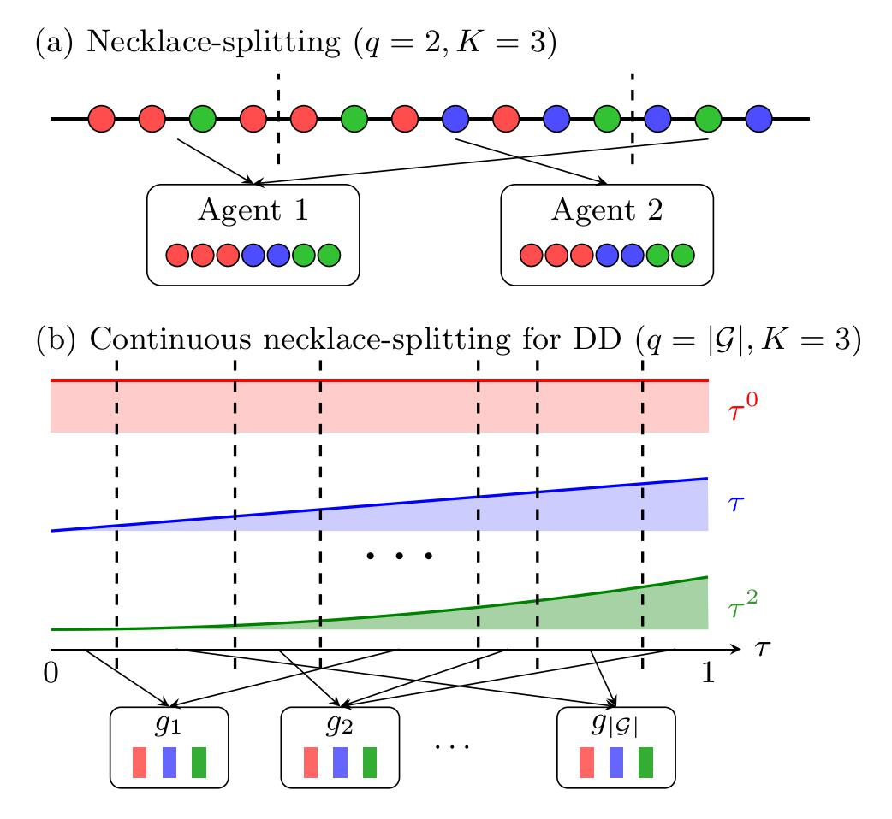

# High-order dynamical decoupling for arbitrary noise in the weak-coupling regime

Implementation and numerical demos for "High-order dynamical decoupling for arbitrary noise in the weak-coupling regime".

  

(a) Discrete necklace-splitting example with two agents ($q=2$) and three colors ($K=3$): by choosing two cuts, each agent receives the same number of red, blue, and green beads. (b) Continuous necklace-splitting picture for dynamical decoupling: the first three time-moments $\int_{0}^{1}\tau^{m}d\tau$ ($K=3$ in this example) are partitioned by the cuts and assigned to the $|\mathcal G|$ agents ($q=|\mathcal G|$) so that each agent receives the same moments. In the DD construction, the cuts mark the pulse times, $\mathcal G$ denotes the decoupling group for the given noise model, and the time-moments correspond to the error terms, whose equal distribution ensures that averaging over the group cancels these contributions. The necklace-splitting theorem guarantees that there exist at most $(q-1)K$ such cuts.

This folder contains:
- `dd/`: helper modules (moments optimization, Hamiltonian/evolver, pulse compilation, metrics/plotting)
- `least_square_dd_optimization.ipynb`: Confirmation of error scaling in $T$ for different values of $J$ (Fig. 2)
- `qdd_comparison_trace_distance.ipynb`: Comparison with QDD (Fig. 3)
